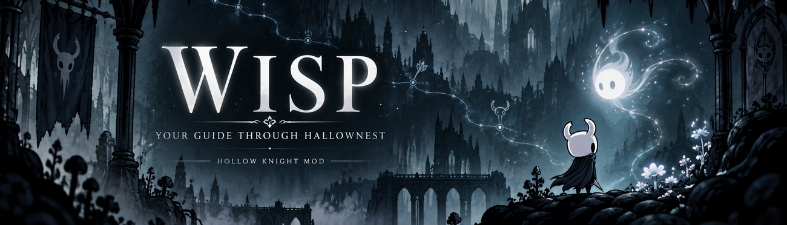

# Wisp 1.1.0

An in-game Hollow Knight companion: three walkthroughs, the Hunter's Journal, maps and collections. **English / Русский.**

**[Download Wisp-1.1.0.zip](https://github.com/Alexandr-Fredrix/Wisp/releases/download/v1.1.0/Wisp-1.1.0.zip)** · [Русский](README.md) · [Changelog](CHANGELOG.md) · [Report an issue](https://github.com/Alexandr-Fredrix/Wisp/issues)

## Install

Requires **Windows x64**, **Hollow Knight 1.5.12620** and **[BepInEx 5.4.23.5 x64](https://github.com/BepInEx/BepInEx/releases/tag/v5.4.23.5)**. This build uses BepInEx, not the Modding API/Scarab loader.

1. Close the game. If needed, install BepInEx beside `hollow_knight.exe`, then launch and close the game once.
2. Extract **Wisp-1.1.0.zip** into the game directory. Verify `BepInEx/plugins/Wisp/Wisp.dll`.
3. Load a save and press **F8** or **both controller sticks together**.
4. Select your language and walkthrough in Wisp Settings.

To update, replace the previous DLL while the game is closed. Existing marks are preserved. **Source code** archives are not needed to install the mod. [Installation and troubleshooting](docs/INSTALL.md).

## Features

- **A:** 112%, achievements and endings. **B:** speed and opposite choices. **C:** Steel Soul.
- **Collections:** 40 Charms, 46 Grubs, 16 Mask Shards and 9 Vessel Fragments, with icons and locations; Charms also include their effects.
- **Hunter's Journal:** entry progress, region filters and habitat maps.
- **Maps and instructions:** 15 atlas maps, galleries, zoom controls and seven Mister Mushroom encounters.
- Separate progress per save, automatic confirmation of supported conditions and manual marks for other tasks.

## Controls

Click to select, use the wheel to scroll text or zoom, and drag to pan. **R** retries failed images.

Controller: **LB/RB** switches tabs, **D-pad** selects, **A/B** opens/goes back, **right stick** scrolls text, **RS click** expands images, and **LT/RT** zooms. Contextual **X/Y** hints appear in the footer.

## Notes

Atlas and collection maps are bundled. Some Journal images download on first view and are cached afterward. Three maps—the Abyss, Fog Canyon and Queen's Gardens—still have Russian labels inside the image. Native-map destination markers are not implemented. Choosing walkthrough C does not convert a normal save into Steel Soul.

Automated checks pass; a complete in-game pass of both languages and physical controllers is still pending.

By **Alex / Alexandr-Fredrix**. [License](LICENSE) · [Asset credits](THIRD_PARTY_NOTICES.md) · [Build from source](docs/DEVELOPMENT.md). Hollow Knight belongs to Team Cherry. The cover is AI-generated artwork.
