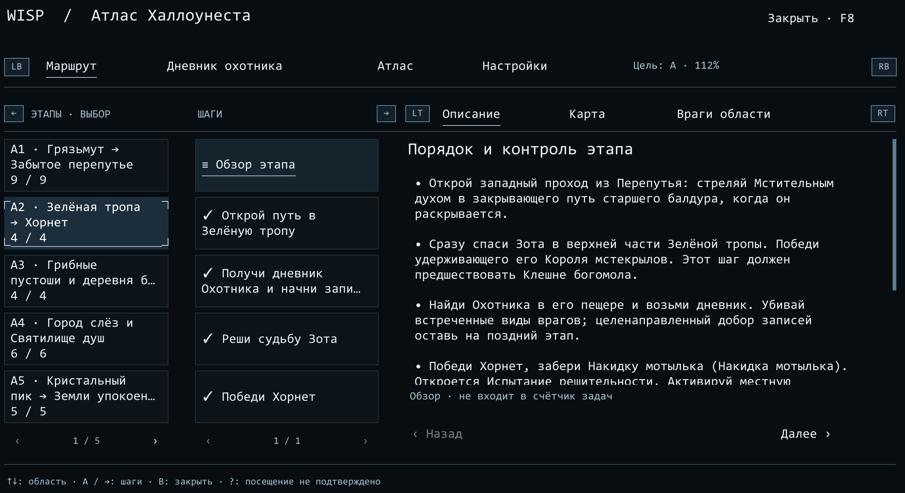
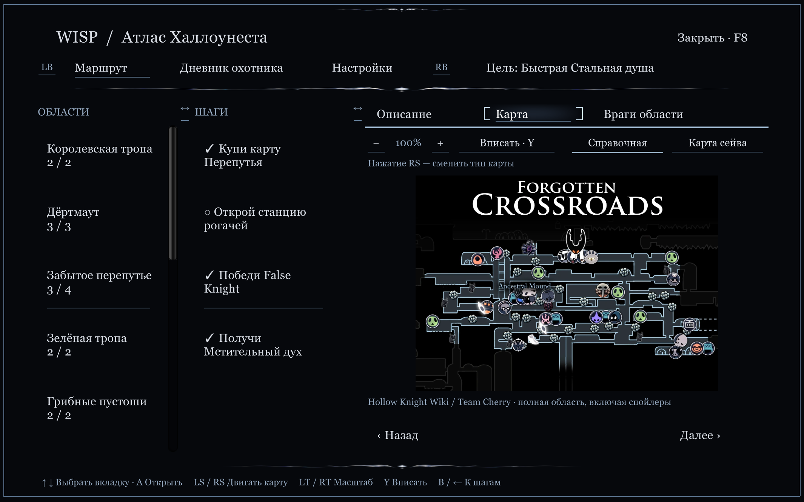
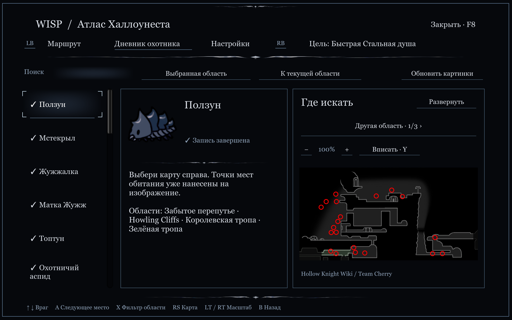
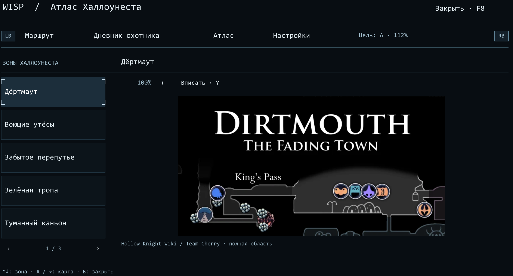
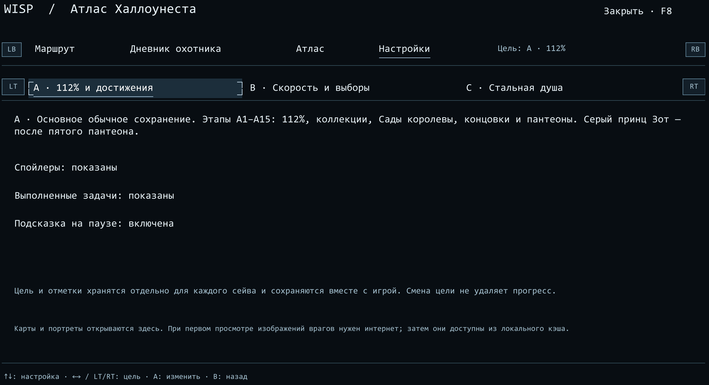
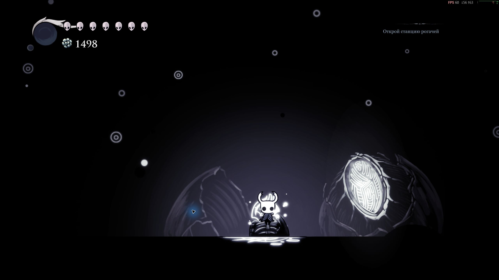

<div align="center">

# Wisp

**Твой проводник по Халлоунесту — прямо в игре.**

Пошаговый помощник для **112%**, всех достижений, скоростных концовок, **Steel Soul**, Дневника Охотника и карт мира.

[](https://github.com/Alexandr-Fredrix/Wisp/releases)
[](https://github.com/Alexandr-Fredrix/Wisp/actions/workflows/ci.yml)


[**Скачать**](https://github.com/Alexandr-Fredrix/Wisp/releases) · [**English**](README.en.md) · [**Установка**](docs/INSTALL.md) · [**Сообщить об ошибке**](https://github.com/Alexandr-Fredrix/Wisp/issues/new/choose)

</div>

---

## Что умеет Wisp

- 🧭 **Маршруты прохождения** — основной путь к 112%, достижениям, альтернативным решениям и финалам.
- 🏆 **Achievement companion** — достижения связываются с конкретными этапами и действиями текущего сейва.
- ⚡ **Speedrun и Steel Soul** — отдельные цели и маршруты без смешивания прогресса между сейвами.
- 🗺️ **Карты и иллюстрации** — карты областей, изображения целей, предметов, боссов и коллекций прямо внутри игры.
- 📖 **Дневник Охотника** — прогресс записей, выбор локации и карты мест обитания.
- 🍄 **Господин Гриб** — все семь встреч вынесены в последовательный маршрут.
- 🌐 **Русский + English** — оба языка находятся в одном архиве, переключение не сбрасывает прогресс.
- 🎮 **Мышь, клавиатура и контроллер** — навигация, прокрутка описаний, галерея и масштабирование карт.

## Как это выглядит



<details>
<summary><b>Показать ещё скриншоты</b></summary>
<br>

| Карта маршрута | Дневник Охотника |
|---|---|
|  |  |

| Атлас | Настройки |
|---|---|
|  |  |



</details>

## Быстрый старт

1. Установите [**BepInEx 5.4.23.5 x64**](https://github.com/BepInEx/BepInEx/releases/tag/v5.4.23.5) в папку Hollow Knight.
2. Скачайте **Wisp-1.0.0.zip** в разделе [Releases](https://github.com/Alexandr-Fredrix/Wisp/releases).
3. Распакуйте архив в папку игры. Должен появиться файл:

```text
Hollow Knight/
└─ BepInEx/
   └─ plugins/
      └─ Wisp/
         └─ Wisp.dll
```

4. Загрузите сейв и нажмите **F8** или **оба стика контроллера**.

> Полная инструкция, обновление, удаление и управление: **[docs/INSTALL.md](docs/INSTALL.md)**.

## Управление

| Действие | Управление |
|---|---|
| Открыть Wisp | `F8` или нажатие обоих стиков |
| Главные вкладки | `LB / RB` |
| Выбор панели / пункта | крестовина / направления |
| Открыть / назад | `A / B` |
| Прокрутка описания | правый стик |
| Выбор локации в Дневнике | `X` |
| Следующая иллюстрация | `Y` |
| Развернуть изображение | нажатие `RS` |
| Масштаб карты | `LT / RT` |

Мышью можно выбирать элементы, колесом — прокручивать или масштабировать, перетаскиванием — двигать карту.

## Как хранится прогресс

Wisp читает достижения из игрового профиля, а условия маршрута — из **текущего сейва**. Действия, которые невозможно подтвердить автоматически, можно отмечать вручную.

Настройки и отметки Wisp хранятся отдельно от игровых сейвов. Смена языка не сбрасывает выбранные цели и прогресс. Выбор маршрута Steel Soul **не изменяет настоящий режим сейва**.

## Совместимость

- **Hollow Knight:** `1.5.12620`
- **ОС:** Windows x64
- **BepInEx:** `5.4.23.5 x64`
- **Wisp:** `1.0.0`
- **Языки:** Русский / English

Многие изображения встроены в мод. Остальные карты и портреты загружаются при первом просмотре и остаются в локальном кэше.

> **Статус проверки:** автоматические проверки сборки, контента, core-логики и локализации проходят. Финальный двуязычный интерфейс ещё требует полного игрового прогона. Подробнее: [TESTING.md](docs/TESTING.md).

## Для разработчиков

```text
src/       код мода
content/   маршруты, локализация и встроенные медиа
tests/     автоматические проверки
tools/     сборка, валидация и упаковка
docs/      установка и техническая документация
```

- [Development](docs/DEVELOPMENT.md)
- [Testing](docs/TESTING.md)
- [Releasing](docs/RELEASING.md)
- [Changelog](CHANGELOG.md)

## Проект

Автор: **Alex / [Alexandr-Fredrix](https://github.com/Alexandr-Fredrix)**

[Discussions](https://github.com/Alexandr-Fredrix/Wisp/discussions) · [Issues](https://github.com/Alexandr-Fredrix/Wisp/issues) · [License](LICENSE) · [Third-party materials](THIRD_PARTY_NOTICES.md)

Бесплатная личная игра разрешена. Перепродажа, переиздание и использование новых защищённых материалов в чужих проектах требуют разрешения согласно `LICENSE`. Ранее опубликованные MIT-версии сохраняют свои условия. **Hollow Knight** и игровые материалы принадлежат Team Cherry.
